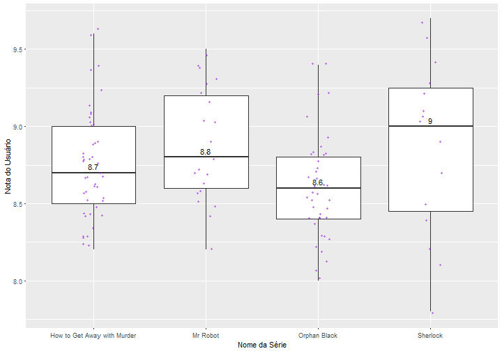

**O conjunto de dados**

Nosso conjunto de dados consiste em séries e suas respectivas avaliações que estão disponíveis no [IMDB](http://imdb.com).


series = read.csv("series_from_imdb.csv")


**O subconjunto de séries**

Dentre as séries do IMDB a seguintes foram escolhidas para serem avaliadas. Para cada série usaremos as seguintes informações: nome da série, a temporada de cada episódio e a nota dada a cada episódio. Os votos dos usuários do site são a forma de classificar as séries.


series_filtradas = series %>% filter(series_name %in% c("How to Get Away with Murder", "Mr Robot","Orphan Black","Sherlock"))



## Warning: package 'bindrcpp' was built under R version 3.3.3



unique(series_filtradas$series_name)



## [1] How to Get Away with Murder Mr Robot                   
## [3] Sherlock                    Orphan Black               
## 511 Levels: 100 Questions 11.22.63 12 Monkeys ... Zero Hour


*Pergunta 1:Qual das séries que você escolheu é mais bem avaliada no IMDB? A diferença é grande? Pequena?*
Para responder essa pergunta consideramos o critério de avaliação dos usuários e também que uma série mais bem avaliada é aquela que pela mediana de avaliações dos episódios teve esta medida maior do que as outras séries analisadas. Optamos usar a mediana porque ela não é afetada por valores extremamente altos ou baixos como a média é e isso torna mais justa a comparação entre séries que possuem temporadas e números de episodios.


series_filtradas %>%
  ggplot(aes(x = series_name,y = UserRating)) + geom_boxplot() + labs(title = "Avalição de séries do subconjunto", x= "Nome da Série", y= "Nota do Usuário")+ geom_jitter(width = .1, size = 1, alpha = .5, color = "purple")+  stat_summary(aes(label=round(..y..,2)), fun.y=median, geom="text", size=4, vjust = -0.5)


A partir do boxplot é possível observar que Sherlock é a série mais bem avaliada do nosso subconjunto, porém não fica distante das outras séries. A segunda colocada, por exemplo, é Mr Robot e está apenas 0.2 ponto abaixo da mais bem colocada. E a última colocada, Orphan Black está a 0.4 ponto abaixo de Sherlock. 

*Pergunta 2:Qual das séries que você escolheu tem episódios de qualidade mais irregular segundo o IMDB? A diferença é grande? Pequena?*

Para responder essa pergunta voltaremos boxplot porém atentando para a distância entre quartis. Você pode consultar um pouco sobre essas medidas [aqui](http://www.escolaedti.com.br/o-que-e-um-box-plot/). 


series_filtradas %>%
  ggplot(aes(x = series_name,y = UserRating)) + geom_boxplot() + labs(x= "Nome da Série", y= "Nota do Usuário")+ geom_jitter(width = .1, size = 1, alpha = .5, color = "purple") +  stat_summary(aes(label=round(..y..,2)), fun.y=median, geom="text", size=4, vjust = -0.5)


É possível perceber que Sherlock é a série com o maior boxplot. Isso indica que há uma maior variação de notas entre os episódios, ou seja, uma irregularidade. Orphan Black é a série que tem a mediana mais próxima ao meio do boxplot (e possui o menor dentre as séries analisdas) e pode ser considerada como a mais regular.

Para destrinchar o que foi visto no boxplot observaremos o gráfico de linhas que mostra as notas de cada episódio de cada temporada. Vale observar que as séries não possuem o mesmo número de temporadas.


series_filtradas %>%
  ggplot(aes(x = season_ep,y = UserRating, color = series_name)) + geom_line() + facet_grid(series_name~season)+ labs(x= "Temporada da Série", y= "Nota do Usuário")


Agora, analisando as séries por temporada, é possível perceber que Sherlock possui os grandes picos de qualidade. Apesar de ter poucos episódios ela não se mantém estável e isso reforça o que foi visto no boxplot. Porém, essa instabilidade em avaliações se repete para todas as séries. A primeira temporada de Orphan Black é a de mais continuidade, ou seja, onde não há grandes picos de avaliações positivas/negativas e contribui no boxplot ter mostrado essa série como a mais regular.
